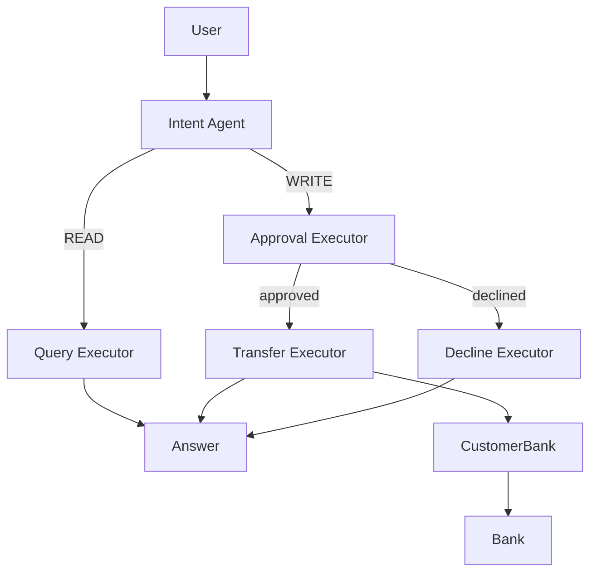

# MiniBank AI

A Microsoft Agent Framework assistant for a small banking domain. Lookups go through read-only tools. Deposits, withdrawals, and transfers cannot be invoked by the model; they run only after a workflow approval step.

The bank itself lives in this repo: accounts, concurrency, persistence, and the `Bank` service. The hosts seed an in-memory bank, authenticate a demo customer, and chat through a customer-scoped `BankingWorkflow`.

## Layout

| Project | Role |
|---|---|
| `MiniBank.Domain` | Accounts (`CurrentAccount`, `SavingsAccount`), exceptions, per-account locks |
| `MiniBank.Repositories` | `IAccountRepository` and `PostgresAccountRepository` |
| `MiniBank.Services` | `Bank` (deposit / withdraw / transfer) and `IAuditLogger` |
| `MiniBank.AI` | Agents, tools, workflow, telemetry |
| `MiniBank.Api` | Minimal API host + Serilog + OpenTelemetry |
| `MiniBank.Console` | Interactive host + Serilog + OpenTelemetry |
| `MiniBank.AI.Tests` | Query-agent tests, workflow routing tests, and owner-resolution unit tests |

Solution: `MiniBank.AI.slnx`.

## Banking domain

`Bank` is the only write path. It loads accounts from `IAccountRepository`, mutates them, persists, and audits.

| Type | Extra rule |
|---|---|
| `CurrentAccount` | Withdrawals may use an overdraft limit |
| `SavingsAccount` | Withdrawals cannot exceed the balance; can apply interest |

Account mutation is lock-gated (`AsyncFriendlyLock`). Transfers take both locks in account-number order via `Account.LockAllAsync` so two accounts cannot deadlock.

The console and tests use an in-memory repository. `PostgresAccountRepository` (Npgsql) is the durable implementation of the same interface.

## Prerequisites

- .NET 10
- [Ollama](https://ollama.com) at `http://localhost:11434`
- Model `qwen2.5:1.5b-instruct`

Standalone app:

```bash
ollama pull qwen2.5:1.5b-instruct
```

Or run the same model in Kubernetes instead (CPU worker, no standalone Ollama app): see [`k8s/README.md`](k8s/README.md). Port-forward `svc/ollama` to `localhost:11434` so host `appsettings.json` does not change.

Optional: an OTLP collector at `http://localhost:4317` (see `MiniBank.Console/appsettings.json`). Tracing can be turned off with `"Tracing": { "Enabled": false }`.

## Run

### Demo login

Both hosts use the same in-memory mock identity service. Demo credentials are:

| Username | Password | Customer | Accounts |
|---|---|---|---|
| `alice` | `alice` | Alice Example | 1234567890 |
| `john` | `john` | John Smith | 10001 / 10002 |
| `jane` | `jane` | Jane Doe | 20001 |

One login session is one customer. A customer can read and debit only their own accounts; transfers may credit another customer's account.

### Console

```bash
dotnet run --project MiniBank.Console
```

The console seeds the in-memory bank, prompts for the demo username/password, then prompts for questions. Type `quit` (or `exit` / `q` / `bye`) to leave. After each turn it prints the executor path (`IntentAgent → QueryExecutor`, and so on) and the assistant reply.

### API

```bash
dotnet run --project MiniBank.Api
```

The API serves at `http://localhost:5000` by default. It exposes:

- `POST /login` — accepts demo credentials and returns a bearer token
- `POST /chat` — accepts a question and returns the workflow answer plus executor path
- `GET /health` — returns `200 OK` without calling Ollama

Example as John Smith (accounts 10001 and 10002):

```bash
TOKEN=$(curl -s -X POST http://localhost:5000/login \
  -H "Content-Type: application/json" \
  -d '{"username": "john", "password": "john"}' | jq -r .token)

curl -X POST http://localhost:5000/chat \
  -H "Content-Type: application/json" \
  -H "Authorization: Bearer $TOKEN" \
  -d '{"question": "What is the balance of account 10001?"}'
```

Response:

```json
{
  "output": "The balance of account 10001 is £1,532.42.",
  "executorIds": ["IntentAgent", "QueryExecutor"]
}
```

Without a valid bearer token, `POST /chat` returns `401 Unauthorized` and does not run a workflow turn. `GET /health` remains anonymous.

### Tests

```bash
dotnet test MiniBank.AI.Tests/MiniBank.AI.Tests.csproj
```

Ollama-backed tests fail immediately if Ollama is not reachable. They are not parallelized (`[Collection("Ollama")]`). `CustomerToolsTests`, authorization tests, identity tests, and API authentication tests do not need Ollama.

## Seed data

| Account | Owner | Type | Balance |
|---|---|---|---|
| 1234567890 | Alice Example | Current | £2,450.00 |
| 10001 | John Smith | Current | £1,532.42 |
| 10002 | John Smith | Savings | £800.00 |
| 20001 | Jane Doe | Current | £5,000.00 |

The seeded internal total is **£9,782.42**, but customer sessions do not expose whole-bank totals. John Smith’s combined visible balance is **£2,332.42**.

Owner lookups accept a full name or a unique first name within the authenticated customer's visible accounts (`Alice` → Alice Example when signed in as Alice). Other customers match nothing.

## Workflow

The console and workflow tests enter through `BankingWorkflow`, not a single agent with every tool.

```text
                    User
                      │
                      ▼
                Intent Agent
                      │
              ┌───────┴────────┐
              │                │
            READ             WRITE
              │                │
              ▼                ▼
       Query Executor    Approval Executor
                               │
                     ┌─────────┴─────────┐
                     │                   │
                 approved            declined
                     │                   │
                     ▼                   ▼
              Transfer Executor    Decline Executor
                     │
                     ▼
              CustomerBank →
              Bank.Deposit /
              Bank.Withdraw /
              Bank.Transfer
```



### Why this graph exists

A single chat agent with `deposit` / `withdraw` / `transfer` tools would let the model move money as soon as it emitted a function call. Writes are therefore **not** registered on the query agent.

1. **Intent Agent** classifies the utterance. It never touches balances.
2. **READ** goes to **Query Executor**, which runs the query agent with read-only tools.
3. **WRITE** goes to **Approval Executor**, which checks structure (positive amount, account numbers, distinct transfer endpoints) and then asks `IWriteApprover`.
4. Only an approved write reaches **Transfer Executor**, which calls `OperationTools` → `Bank`.
5. A declined write goes to **Decline Executor** and never updates accounts.

`AutoApprover` is the default (approve every structurally valid write). Swap `IWriteApprover` for a human or policy check without changing the graph.

### Executors

| Id | Type | Input | Output |
|---|---|---|---|
| `IntentAgent` | LLM wrapper | user text | `BankingIntent` |
| `QueryExecutor` | LLM + READ tools | `BankingIntent` | answer string |
| `ApprovalExecutor` | code | `BankingIntent` | `ApprovalResult` |
| `TransferExecutor` | code | approved `ApprovalResult` | confirmation string |
| `DeclineExecutor` | code | rejected `ApprovalResult` | decline string |

Built in `MiniBank.AI/Workflows/BankingWorkflow.cs` with `WorkflowBuilder` + `AddSwitch`.

## Tools

### Intent (routing only)

Used only by the Intent Agent. They return a `BankingIntent`; they do not call `Bank`.

| Tool | Meaning |
|---|---|
| `classify_query` | Lookup: balances, accounts, history, totals, “how many deposits” |
| `classify_deposit` | Put money into an account now |
| `classify_withdraw` | Take money out of an account now |
| `classify_transfer` | Move money between two accounts now |

Listing deposits that already happened is a **query**, not `classify_deposit`.

### READ (query agent)

Used only by `BankingAgent` / Query Executor. These never change balances. Owner-name tools go through `OwnerResolver`.

| Tool | When |
|---|---|
| `get_balance` | User supplied a specific account number |
| `get_owner_total_balance` | Named customer, no account number |
| `find_accounts_by_owner` | List a customer’s accounts |
| `get_total_value` | Sum of every visible account for the authenticated customer |
| `get_highest_balance_account` | Visible account with the largest balance for the authenticated customer |
| `count_deposits_by_owner` | How many deposits a customer has made |
| `get_deposits` | Deposits on one numbered account |
| `get_account_history` | Full history of one numbered account |

Implemented in `AccountTools`, `CustomerTools`, and `TransactionTools`; registered together by `QueryTools`.

### WRITE (workflow only)

`OperationTools` wraps the customer-scoped bank. The LLM never receives these. `TransferExecutor` calls them after approval.

| Method | Bank call |
|---|---|
| `deposit` | `Bank.DepositAsync` |
| `withdraw` | `Bank.WithdrawAsync` |
| `transfer` | `Bank.TransferAsync` |

## Agents

**Intent Agent** (`IntentAgent`) — temperature 0, routing tools only. Output is parsed from the function call into `BankingIntent`.

**Query Agent** (`BankingAgent`) — temperature 0, READ tools only. Used standalone in query tests, and as Query Executor inside the workflow.

Both talk to Ollama via `OllamaSharp` (`qwen2.5:1.5b-instruct`).

## Tests

Most tests use the real Ollama model, not a scripted chat client. `RecordingChatClient` records tool calls; `RecordingAccountRepository` records lookups and updates.

| Class | What it asserts |
|---|---|
| `BankingAgentTests` | Unambiguous lookups: correct READ tool, arguments, and facts in the answer |
| `BankingAgentAmbiguityTests` | Similar questions that must not pick the neighbouring tool |
| `BankingWorkflowTests` | READ skips approval/transfer; approved transfer updates balances; rejected transfer does not |
| `CustomerToolsTests` | Owner totals match a unique first name or a full name (no LLM) |

Answer assertions check amounts and names, not exact LLM wording.

## Telemetry

Serilog logs agent queries, LLM responses, and tool execution. OpenTelemetry spans:

- `MiniBank.Agent` — `agent.run`, `agent.llm.chat`
- `MiniBank.Tools` — `tools.execute`
- Microsoft Agent Framework / Extensions.AI sources
- HTTP client calls to Ollama

Export is OTLP gRPC to `http://localhost:4317` when tracing is enabled.
